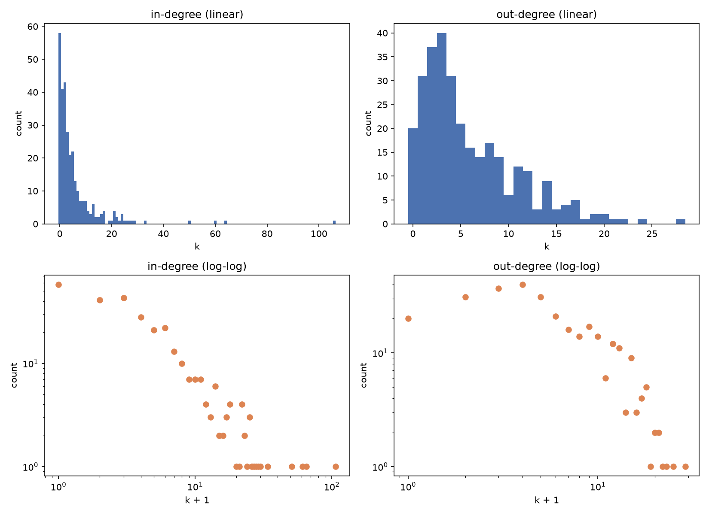
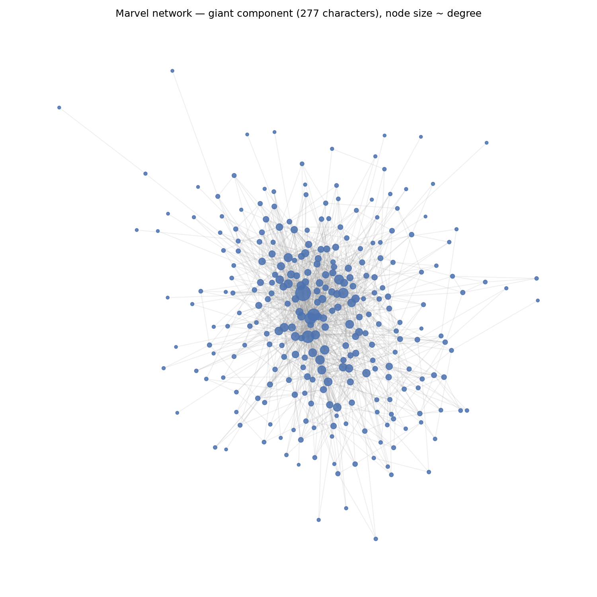

> **DRAFT.** This is a template for the week-1 post, not a finished write-up. Every section
> below is a placeholder — replace it with your own work. Do not fill in findings or
> conclusions you have not actually produced.

## Question

_TODO: what did you ask? One or two sentences — what made you curious about this week's tools
applied to the Marvel network (or a network of your choice)._

## Methods

_TODO: what did you do? Which tools/notebook, which part of the dataset, which measurements
(e.g. degree distribution, isolates, giant component)?_

## Figure / table

Computed from the real week-1 snapshot (303 nodes, 1,784 directed edges) via
[week1/02_marvel_scaffold.ipynb](https://github.com/kristoferbirgir/SocialGraphInteraction/tree/main/week1/02_marvel_scaffold.ipynb):

_TODO: these are raw computed outputs, not yet interpreted — add a table or a second figure if useful._

## Findings

_TODO: what did you find? Only write this after you've actually looked at the result._

## Limitations

_TODO: what would you not trust about this analysis? What's missing, what's approximate,
what would you check next?_

## AI assistance

_TODO: summarize what AI tools helped with this post (see the repo's `AI_METHODS.md` for the
full log) — what you had it do, what you verified yourself, and anything it got wrong._
